# HomeStat
### General HomeStat Info
HomeStat for [Apple HomeKit](https://www.apple.com/ios/home/) and [Hubitat Elevation](https://hubitat.com) is a dashboard and device control application for your connected home automation devices. Tag each device to one or more Groups. Quickly visualize the status of devices from the main view. Watch the status change on devices as the real time status changes in your home. Drill down into a group for detailed status and the ability to send control commands to the devices. Toggle lights, switches, bulbs and outlets. Dim and change colors on bulbs. Check the battery status on all battery powered devices.
* Assign tags to devices to associate them by categories
* Assign devices to multiple categories
* View the status of all doors & motion detectors
* Toggle the status of lights, switches and outlets
* Change the brightness of bulbs and lights

Follow this link for [detailed setup instructions.](https://smurphy-git.github.io/HomeStat/detailedSetup)

Hubitat Elevation users, follow this for link for [Hubitat Setup](https://smurphy-git.github.io/HomeStat/Hubitat) instructions.

### See the below sample screenshots.

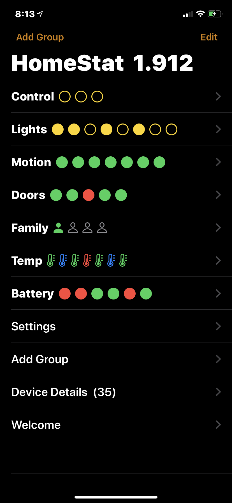
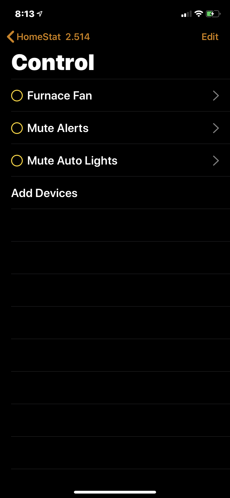
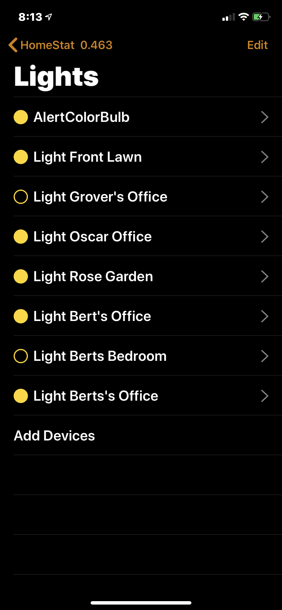
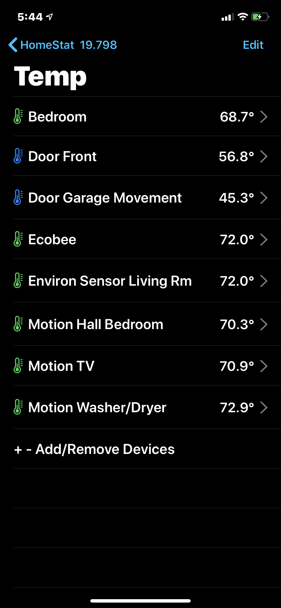
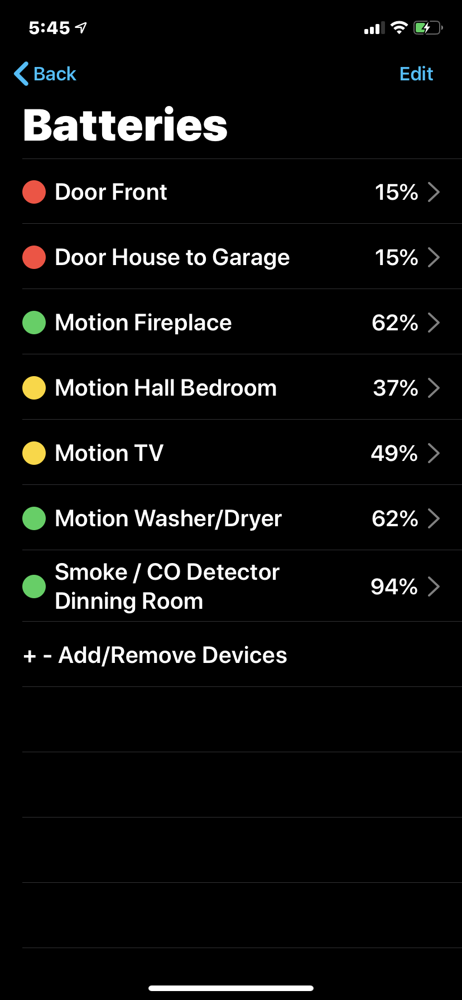
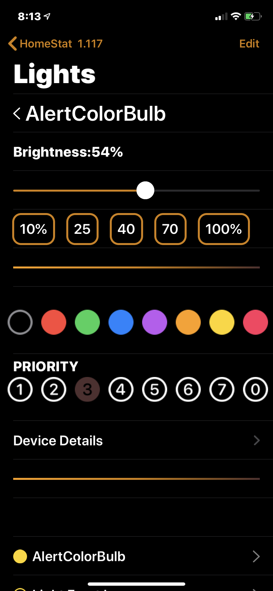
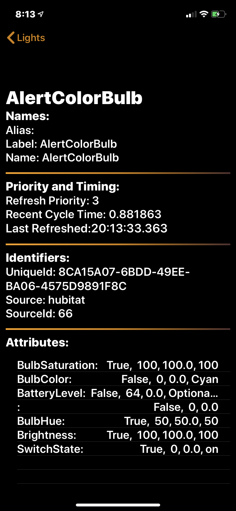
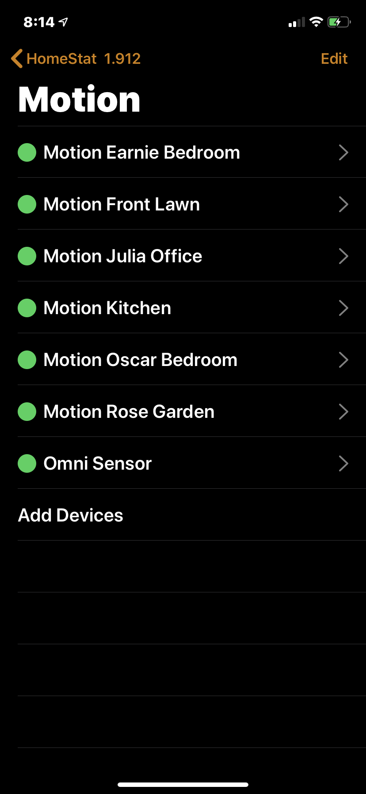
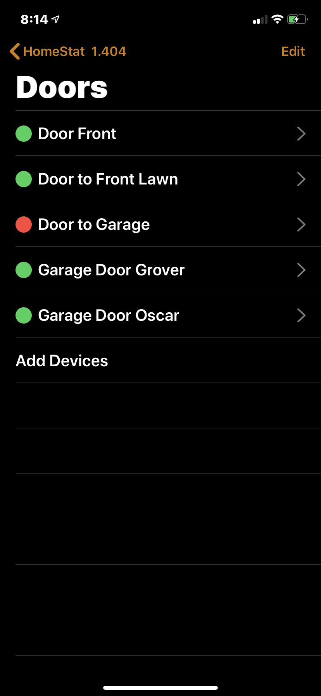
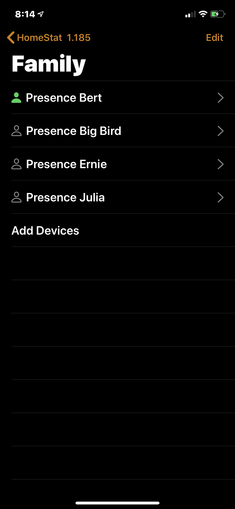
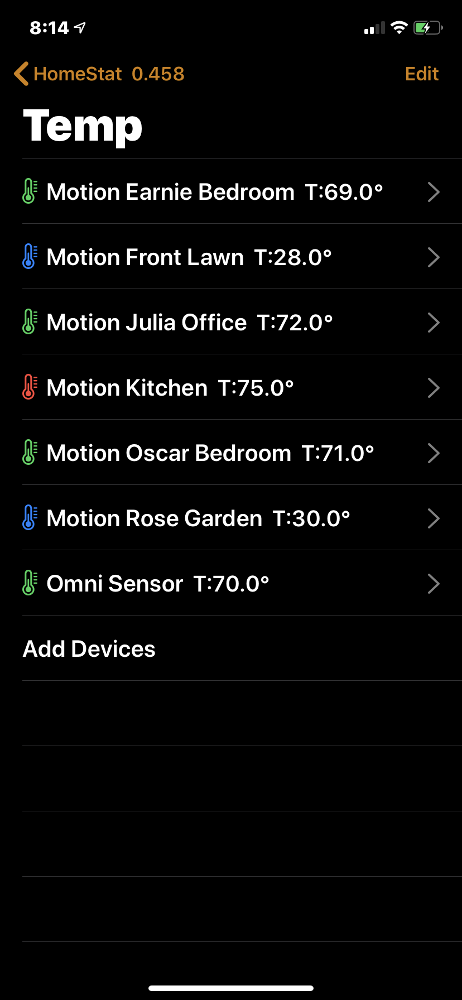
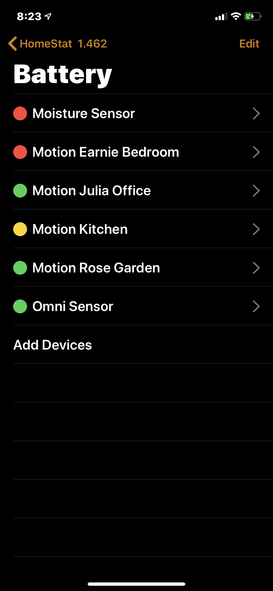
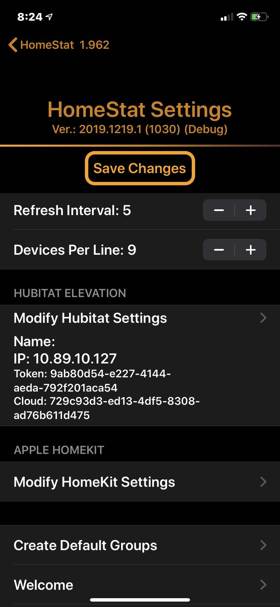
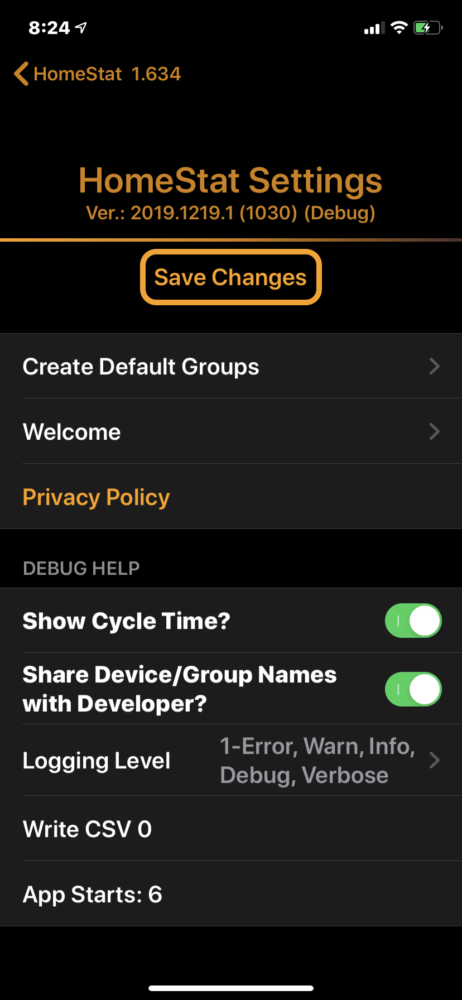

