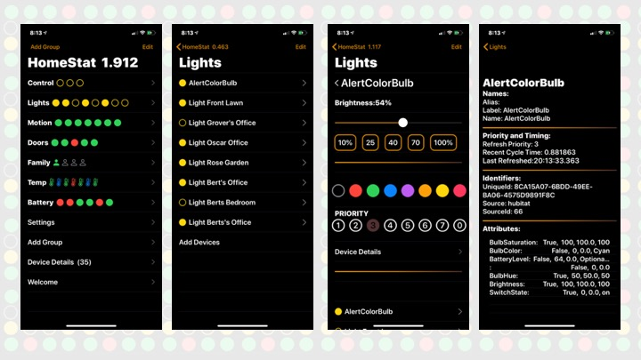
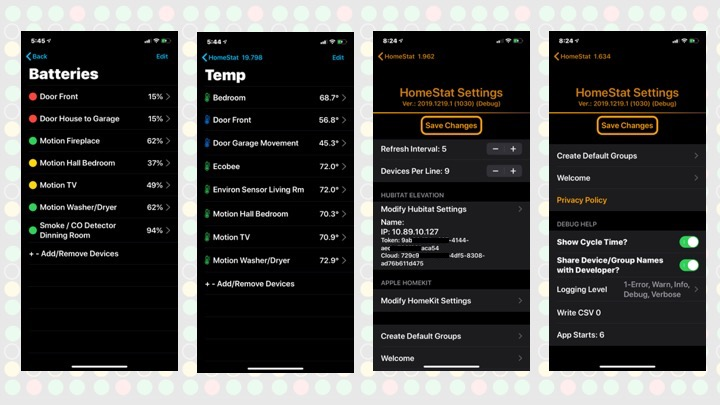
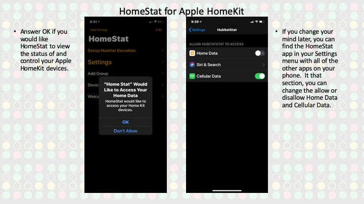

# Welcome to the HomeStat for HomeKit and Hubitat wiki
## Subhead
### Minor Headline

**HomeStat for Hubitat** is a dashboard and device control application for your Hubitat connected home automation devices. Tag each device to one or more Groups. Quickly visualize the status of devices from the main view. Watch the status change on devices as the real time status changes in your home. Drill down into a group for detailed status and the ability to send control commands to the devices. Toggle lights, switches, bulbs and outlets. Dim and change colors on bulbs. Check the battery status on all battery powered devices.
* Assign tags to devices to associate them by categories
* Assign devices to multiple categories
* View the status of all doors & motion detectors
* Toggle the status of lights, switches and outlets
* Change the brightness of bulbs and lights

**Dashboard:** The main screen of HomeStat.  It shows GroupNames and the status of the devices associated with the groups.

**Group:** The core concept of HomeStat is placing your devices into one of more groups.  Those groups are displayed on the dashboard of HomeStat.   

**Priority:**  The frequency at each data is requested for each device.
* Priority 1 - Poll every cycle
* Priority 2 - Poll every other cycle
* Priority 3 - Poll every 4th cycle - default when a device is first assigned to any group
* Priority 4 - Poll every 8th cycle
* Priority 5 - Poll every 16th cycle - default for devices not assigned a group
* Priority 6 - Poll every 32nd cycle
* Priority 7 - Poll every 64th cycle
* A setting / parameter assigned to each device.  The priority of each device translates into the frequency to which data is requested from the Hubitat hub for each device.  
* When on a Group Page, each device in the group is polled every cycle.
	
**Refresh Interval:**  The number of seconds between refresh requests this HomeStat app requests data from your Hubitat hub.

**Cycle Time:** Advanced Setting - The duration (seconds) for a recent refresh cycle, from when data was requested from a device, to when data was received from that device.  You do not want the cycle time to be greater than the refresh interval.  This data is displayed at the top of the screen with the HomeStat name.
	
**HomeStat Settings**
Refresh Interval (seconds)
HomeStat will poll your Hubitat at regular intervals.  The default interval is once every 5 seconds.  The Refresh Interval is very tightly integrated with the Priority of each device.   By default, each new device is set to a priority of 3 (poll every 4th cycle).  When a device is associated with any group, the poll interval is raised to a priority of 3 (poll every 4th cycle).
* Devices Per Line: 
* Default: 7
* When a group has more devices than this parameter, it will separate the group name and device status icons into multiple lines.

***Hubitat Configuration:***
This section displays a summary of the current Hubitat configuration.  Select this to modify the settings.
Show Cycle Time:
When selected, the cycle time of a recent polling cycle will display with the HomeStat app name at the top of the screen.  The cycle time is the duration from when data is requested from a device, to when data is received from a device.

**Hubitat Settings**
	• HomeStat currently has the capability to poll data from only one hub.  Eventually, I hope to expand the functionality to poll data from multiple hubs.
	• Hubitat has API functionality that is core to the functionality of HomeStat.  You must properly configure the Maker API from within Hubitat so that data can be retrieved from your Hubitat hub.
* https://docs.hubitat.com/index.php?title=Hubitat™_Maker_API
* https://smurphy-git.github.io/HomeStat/Hubitat

